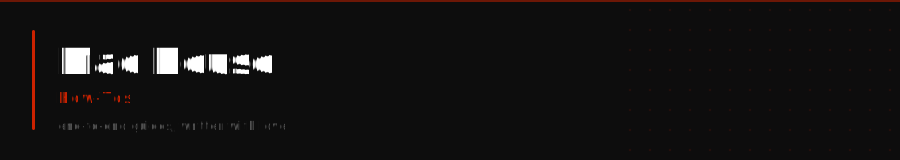

<a href="#vibe-coding"></a>&nbsp;<a href="#vps-server"></a>&nbsp;<a href="#bots"></a>&nbsp;<a href="#incubation"></a>&nbsp;<a href="#org-setup"></a>

---

End-to-end guides for building AI-native products, tools, and infrastructure from the ground up. Written for people who want to understand what they're building - not just copy and paste it.

The goal is to eventually package these into premium tutorials with assets, video walkthroughs, and deeper reference material. The notebooks here are the source of truth.

---

## Before you start

You will need:

- A GitHub account and `gh` CLI installed and authenticated (`gh auth login`)
- A Linux machine or WSL2 on Windows
- `git`, `bash`, `python3`, `node` / `npm` installed
- [Claude Code](https://claude.ai/code) for the vibe-coding guides (`npm install -g @anthropic-ai/claude-code`)
- A VPS (any provider) for the VPS and deployment guides - DigitalOcean, Hetzner, or equivalent

Every guide states its prerequisites at the top. Start with what you have.

## Getting the notebooks

```bash
git clone https://github.com/madebymadhouse/how-tos.git
cd how-tos
code .
```

Open in VS Code (best experience) or any Jupyter-compatible viewer. Notebooks are written to be read linearly - code cells are runnable but reading is enough to follow along.

---

##  Vibe Coding

Building with AI as your pair programmer. This section covers the infrastructure layer: how to give Claude persistent instructions, custom tools it can call, and how to write prompts that produce consistent results.

<br/>

### [How to Build Skills](vibe-coding/skills/how-to-build-skills.ipynb)

Skills are custom slash commands that give Claude a deterministic tool backed by a shell script. Instead of re-explaining how to do something every session, you write it once and Claude runs it precisely.

**You will build:** a working skill from scratch - SKILL.md, a bash script with JSON output, and the wiring that makes Claude call it correctly.

**You will understand:**
- The agentskills.io specification and why it separates deterministic work from AI judgment
- How to structure scripts so Claude never has to guess at output
- When to use a script vs letting Claude interpret directly
- How to publish a skill so teammates can install it in one command

**Prerequisites:** bash basics, Claude Code installed &nbsp;·&nbsp; **Difficulty:** Beginner &nbsp;·&nbsp; `vibe-coding/skills/`

---

### [How to Build Agents](vibe-coding/agents/how-to-build-agents.ipynb)

Agents are Claude instances with persistent instructions, memory, and custom tool access. This guide covers building and deploying real agents - not toy demos.

**You will build:** a scoped agent with its own AGENTS.md, a defined set of tools, and clear behavioral guardrails.

**You will understand:**
- The difference between Claude Code slash commands and a deployed agent
- How AGENTS.md files work and why they're the agent's single source of truth
- How to scope an agent so it only touches what it should
- How to add tools to an agent and write defensive instructions

**Prerequisites:** Claude Code, familiarity with skills &nbsp;·&nbsp; **Difficulty:** Intermediate &nbsp;·&nbsp; `vibe-coding/agents/`

---

### [How to Prompt](vibe-coding/prompts/how-to-prompt.ipynb)

Prompting is a skill. This is the guide for writing prompts that produce consistent, high-quality output across repeatable workflows - not just one-offs.

**You will learn:**
- How to structure prompts for complex multi-step tasks
- The difference between one-shot prompts and iterative conversation patterns
- How to write prompts that Claude will follow precisely without drifting
- Real-world prompt templates for code, planning, review, and generation tasks

**Prerequisites:** None &nbsp;·&nbsp; **Difficulty:** Beginner &nbsp;·&nbsp; `vibe-coding/prompts/`

---

##  VPS & Server

Running your own server. This section covers the full lifecycle: provisioning a VPS from scratch, keeping it healthy, and deploying applications using Coolify.

<br/>

### [VPS Setup](vps/setup/vps-setup.ipynb)

Provision a production-ready Linux VPS from a blank slate. Every step is explained - not just the commands but why each one matters.

**You will build:** a secured, Docker-ready VPS with Traefik for routing, fail2ban for protection, and Tailscale for private access.

**You will understand:**
- How to harden a fresh VPS against common attacks (SSH keys, firewall, fail2ban)
- How Docker networking works and why Traefik sits in front of everything
- How Tailscale gives you private access without exposing ports
- How to structure your server so adding new services is one command, not a project

**Prerequisites:** A VPS with SSH access, basic Linux familiarity &nbsp;·&nbsp; **Difficulty:** Beginner–Intermediate &nbsp;·&nbsp; `vps/setup/`

---

### [VPS Maintenance](vps/maintenance/vps-maintenance.ipynb)

A server that runs itself is a server you can ignore - until something breaks. This guide covers the routines, monitoring patterns, and recovery steps that keep a production VPS healthy.

**You will learn:**
- What to check weekly vs monthly vs only when something is wrong
- How to read Docker logs, resource stats, and disk usage to spot problems early
- How to update containers safely without downtime
- How to recover from the most common failure modes: full disk, OOM, crashed container

**Prerequisites:** Completed VPS Setup or equivalent &nbsp;·&nbsp; **Difficulty:** Intermediate &nbsp;·&nbsp; `vps/maintenance/`

---

### [Coolify Deployments](vps/coolify/coolify-deployment.ipynb)

Coolify is a self-hosted deployment platform - Heroku-style deploys from your own server. This guide covers installing it, deploying your first app, and building the workflow for consistent production deployments.

**You will build:** a working Coolify instance with at least one application deployed end-to-end, including environment variables, a custom domain, and TLS.

**You will understand:**
- How Coolify wraps Docker Compose and what that means for your deployment
- How to wire up a custom domain with automatic TLS via Let's Encrypt
- How to manage environment variables securely without committing secrets
- How to trigger deploys from Git push and monitor them in real time

**Prerequisites:** Completed VPS Setup, a domain name, a GitHub repo with a Dockerfile &nbsp;·&nbsp; **Difficulty:** Intermediate &nbsp;·&nbsp; `vps/coolify/`

---

##  Bots

Discord bots as a deployment pattern - a useful channel for notifications, alerts, and lightweight interfaces to your tools. Not the primary product, but a clean way to expose functionality to a team.

<br/>

### [Discord Bot](bots/discord/discord-bot.ipynb)

Build and deploy a Discord bot that does something useful - connected to your infrastructure for notifications or lightweight control, not a music bot.

**You will build:** a production Discord bot, containerized and deployed via Coolify, with at least one meaningful command or event handler wired to real infrastructure.

**You will understand:**
- How the Discord API and bot token system works end-to-end
- How to handle events and slash commands correctly
- How to Dockerize and deploy a bot so it runs 24/7 without babysitting
- When a bot is the right interface and when it's the wrong one

**Prerequisites:** Python basics, completed Coolify Deployments &nbsp;·&nbsp; **Difficulty:** Intermediate &nbsp;·&nbsp; `bots/discord/`

---

### [Bot Standards](bots/standards/bot-standards.ipynb)

The design principles and operational standards for any bot you build - logging, error handling, rate limits, and the patterns that separate a reliable bot from one that breaks at 2am.

**You will learn:**
- Logging patterns that make bot failures debuggable in production
- How to handle Discord rate limits and API errors gracefully
- The lifecycle of a bot command from user input to response
- What belongs in a bot vs what belongs in a proper API

**Prerequisites:** Discord Bot guide or an existing bot codebase &nbsp;·&nbsp; **Difficulty:** Intermediate &nbsp;·&nbsp; `bots/standards/`

---

##  Incubation

How Mad House takes ideas from spark to shipped - the process, the milestones, and the decisions that move something forward without letting it stall.

<br/>

### [Project Lifecycle](incubation/lifecycle/project-lifecycle.ipynb)

A structured approach to running an idea through stages: concept, prototype, building, shipped, maintained, archived. Not a rigid process - a map.

**You will learn:**
- How to define a project clearly enough that you know when it's done
- The stage gates: what a prototype is, what "building" means, what shipped requires
- How to make the call to archive something vs keep iterating
- How to use the `incubate` skill to track your lab without a separate tool

**Prerequisites:** None &nbsp;·&nbsp; **Difficulty:** Beginner &nbsp;·&nbsp; `incubation/lifecycle/`

---

##  Org Setup

How to structure a GitHub org and wire up routing for a real operation - not a side project, but something you'd hand to a team or build a product on top of.

<br/>

### [Org and Repo Setup](org-setup/github/org-and-repo-setup.ipynb)

How to structure a GitHub org from scratch: naming conventions, repo standards, default files, and the access patterns that make a multi-project org manageable.

**You will build:** a GitHub org with standardized repos, correct visibility settings, branch protection, and all standard files in place.

**You will understand:**
- How to separate public, internal, and archived repos without confusion
- What files every repo needs and why (README, .gitignore, CHANGELOG, Dockerfile)
- How to use the `repo-bootstrap` skill to scaffold new repos in seconds
- How to audit your org for stale repos, missing files, and clutter

**Prerequisites:** GitHub account, `gh` CLI &nbsp;·&nbsp; **Difficulty:** Beginner &nbsp;·&nbsp; `org-setup/github/`

---

### [Traefik Routing](org-setup/routing/traefik-routing.ipynb)

Traefik as a reverse proxy - how to route multiple domains and subdomains to different services on one server, with automatic TLS and zero downtime reloads.

**You will build:** a working Traefik setup that routes at least two domains to two different Docker services, with TLS on both.

**You will understand:**
- How Traefik discovers services via Docker labels - no config file per service
- How Let's Encrypt TLS works with Traefik's ACME challenge
- How to debug routing issues: entrypoints, routers, and middlewares
- How to add a new service to an existing Traefik setup in under 5 minutes

**Prerequisites:** Completed VPS Setup, basic Docker Compose familiarity &nbsp;·&nbsp; **Difficulty:** Intermediate &nbsp;·&nbsp; `org-setup/routing/`

---

<sub>Built at Mad House &nbsp;·&nbsp; [madebymadhouse](https://github.com/madebymadhouse)</sub>
